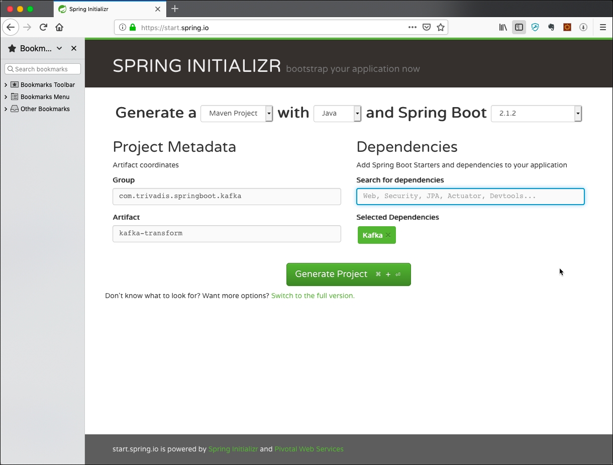

# Using Kafka from Spring Boot
In this workshop we will learn how to use the Spring Kafka abstraction from within a Spring Boot application. We will implement both a consumer and a producer, to get data a string value from an input topic, convert it to uppercase and then send it to the output topic. 

## Creating the necessary Kafka Topics
We will use the topic `test-spring-in` to consume from and the topic `test-spring-out` to produce to from the Spring Boot application. Due to the fact that `auto.topic.create.enable` is set to `false`, we have to manually create the topic. 

Connect to the `broker-1` container

```
docker exec -ti streamingplatform_broker-1_1 bash
```

and execute the necessary kafka-topics commands 

```
kafka-topics --create \
--replication-factor 3 \
--partitions 8 \
--topic test-spring-in \
--zookeeper zookeeper-1:2181

kafka-topics --create \
--replication-factor 3 \
--partitions 8 \
--topic test-spring-out \
--zookeeper zookeeper-1:2181
```

Cross check that the topic has been created.

```
kafka-topics --list \
    --zookeeper zookeeper-1:2181
```

This finishes the setup steps and our new project is ready to be used. Next we will start implementing the **Kafka Producer** which uses Avro for the serialization. 

## Creating the Spring Boot Project
First, let’s navigate to [Spring Initializr](https://start.spring.io/) to generate our project. Our project will need the Apache Kafka support. 

Select Generate a **Maven Project** with **Java** and Spring Boot **2.1.2**. Specify **com.trivadis.springboot.kafka** for the Group and **kafka-transform** for the Artifact. Set **Kafka** as a Depencency. 



Click on **Generate Project** and unzip the ZIP file to a convientent location for development. 

Once you have unzipped the project, you’ll have a very simple structure. 

Import the project as a Maven Project into your favorite IDE for further development. 
## Implement a Kafka Consumer in Spring
Start by creating a simple Java class `KafkaEventConsumer` within the `com.trivadis.springboot.kafka.kafkatransform` package, which we will use to consume messages from Kafka. 

```java
package com.trivadis.springboot.kafka.kafkatransform;

import org.apache.kafka.clients.consumer.ConsumerRecord;
import org.slf4j.Logger;
import org.slf4j.LoggerFactory;
import org.springframework.beans.factory.annotation.Autowired;
import org.springframework.kafka.annotation.KafkaListener;
import org.springframework.stereotype.Component;

@Component
public class KafkaEventConsumer {
	private static final Logger LOGGER = LoggerFactory.getLogger(KafkaEventConsumer.class);
	
	@Autowired 
	private KafkaEventProducer kafkaEventProducer;
	
	@KafkaListener(topics = "${kafka.topic.in}")
	public void receive(ConsumerRecord<Long, String> consumerRecord) {
		String value = consumerRecord.value();
		Long key = consumerRecord.key();
		LOGGER.info("received key = '{}' with payload='{}'", key, value);
		
		// convert to upper
		String valueUpper = value.toUpperCase();
		kafkaEventProducer.produce(key, valueUpper);
	}

}
```

This class uses the `Component` annotation to have it registered as bean in the Spring context and the `KafkaListener` annotation to specify a listener method to be called for each record consumed from the Kafka input topic. The name of the topic is specified as a property to be read from the `application.yml` configuration file.

In the listener method we convert the value into upper case and produce it to the output topic using the injected KafkaEventProducer class implemented next.

## Implement a Kafka Producer in Spring

Now create a simple Java class `KafkaEventProducer` within the `com.trivadis.springboot.kafka.kafkatransform` package, which we will use to produce messages to Kafka.

```java
package com.trivadis.springboot.kafka.kafkatransform;

import org.slf4j.Logger;
import org.slf4j.LoggerFactory;
import org.springframework.beans.factory.annotation.Autowired;
import org.springframework.beans.factory.annotation.Value;
import org.springframework.kafka.core.KafkaTemplate;
import org.springframework.stereotype.Component;

@Component
public class KafkaEventProducer {
	private static final Logger LOGGER = LoggerFactory.getLogger(KafkaEventProducer.class);
	
	@Autowired
	private KafkaTemplate<Long, String> kafkaTemplate;
	
	@Value("${kafka.topic.out}")
	String kafkaTopic;
	
	public void produce(Long key, String value) {
		kafkaTemplate.send(kafkaTopic, key, value);
	}
}
```

It uses the `Component` annotation to have it registered as bean in the Spring context. The topic to produce to is again specified as a property.

## Implement the Kafka Configuration class

Next create a Java class `KafkaConfig` within the `com.trivadis.springboot.kafka.kafkatransform` package, which will create the necessary support classes for the consuming and producing from/to Kafka.

```java
package com.trivadis.springboot.kafka.kafkatransform;

import java.util.HashMap;
import java.util.Map;

import org.apache.kafka.clients.consumer.ConsumerConfig;
import org.apache.kafka.clients.producer.ProducerConfig;
import org.apache.kafka.common.serialization.LongDeserializer;
import org.apache.kafka.common.serialization.LongSerializer;
import org.apache.kafka.common.serialization.StringDeserializer;
import org.apache.kafka.common.serialization.StringSerializer;
import org.springframework.beans.factory.annotation.Value;
import org.springframework.context.annotation.Bean;
import org.springframework.context.annotation.Configuration;
import org.springframework.kafka.config.ConcurrentKafkaListenerContainerFactory;
import org.springframework.kafka.config.KafkaListenerContainerFactory;
import org.springframework.kafka.core.ConsumerFactory;
import org.springframework.kafka.core.DefaultKafkaConsumerFactory;
import org.springframework.kafka.core.DefaultKafkaProducerFactory;
import org.springframework.kafka.core.KafkaTemplate;
import org.springframework.kafka.core.ProducerFactory;
import org.springframework.kafka.listener.ConcurrentMessageListenerContainer;
import org.springframework.kafka.listener.ContainerProperties.AckMode;

@Configuration
public class KafkaConfig {
      @Value("${spring.kafka.bootstrap-servers}")
      private String bootstrapServers;
  

      // Producer Configuration
      
      private Map<String, Object> producerConfigs() {
        Map<String, Object> props = new HashMap<>();
        props.put(ProducerConfig.BOOTSTRAP_SERVERS_CONFIG, bootstrapServers);
        props.put(ProducerConfig.KEY_SERIALIZER_CLASS_CONFIG, LongSerializer.class);
        props.put(ProducerConfig.VALUE_SERIALIZER_CLASS_CONFIG, StringSerializer.class);

        return props;
      }
      
      @Bean
      public ProducerFactory<Long, String> producerFactory() {
        return new DefaultKafkaProducerFactory<>(producerConfigs());
      }

      @Bean
      public KafkaTemplate<Long, String> kafkaTemplate() {
        return new KafkaTemplate<>(producerFactory());
      }

      // Consumer Configuration
      
      private Map<String, Object> consumerConfigs() {
        Map<String, Object> props = new HashMap<>();
        props.put(ConsumerConfig.BOOTSTRAP_SERVERS_CONFIG, bootstrapServers);
        props.put(ConsumerConfig.KEY_DESERIALIZER_CLASS_CONFIG, LongDeserializer.class);
        props.put(ConsumerConfig.VALUE_DESERIALIZER_CLASS_CONFIG, StringDeserializer.class);
        props.put(ConsumerConfig.GROUP_ID_CONFIG, "upperCaser");
        // disable auto commit
        props.put(ConsumerConfig.ENABLE_AUTO_COMMIT_CONFIG, false);
        
        return props;
      }
      
      @Bean
      public ConsumerFactory<Long, String> consumerFactory() {
        return new DefaultKafkaConsumerFactory<>(consumerConfigs());
      }
      
      @Bean
      public KafkaListenerContainerFactory<ConcurrentMessageListenerContainer<Long, String>> kafkaListenerContainerFactory() {
        ConcurrentKafkaListenerContainerFactory<Long, String> factory =
            new ConcurrentKafkaListenerContainerFactory<>();
        factory.setConsumerFactory(consumerFactory());
        
        // set the commit mode to COUNT and commit every 5 records (after they have been processed)
        factory.getContainerProperties().setAckMode(AckMode.COUNT);
        factory.getContainerProperties().setAckCount(5);
        
        return factory;
      }
}
```

We set `enable.auto.commit` to `false` and configure the `AckMode` to `COUNT` to "manually" commit the offset after 5 processed records. You can find the different settings for `AckMode` [here](https://docs.spring.io/spring-kafka/reference/htmlsingle/#committing-offsets).

## Configure Kafka through application.yml configuration file

First let's rename the existing `application.properties` file to `application.yml` to use the `yml` format. 

Add the following settings to configure the Kafka cluster and the name of the two topics:

```yml
spring:
  kafka:
    bootstrap-servers: ${PUBLIC_IP}:9092
kafka:
  topic:
    in: test-spring-in
    out: test-spring-out
```

## Build and Run the application

```bash
mvn package -Dmaven.test.skip=true
```

```bash
java -jar target/kafka-transform-0.0.1-SNAPSHOT.jar
```

## Use Console to test the application

In a terminal window start consuming from the output topic:

```bash
kafkacat -b ${PUBLIC_IP} -t test-spring-out
```

In another terminal window, write to the input topic:

```bash
kafkacat -P -b ${PUBLIC_IP} -t test-spring-in
```
